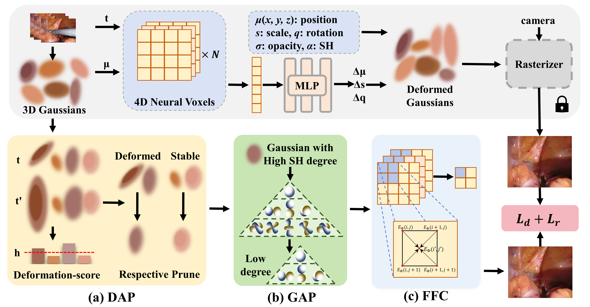
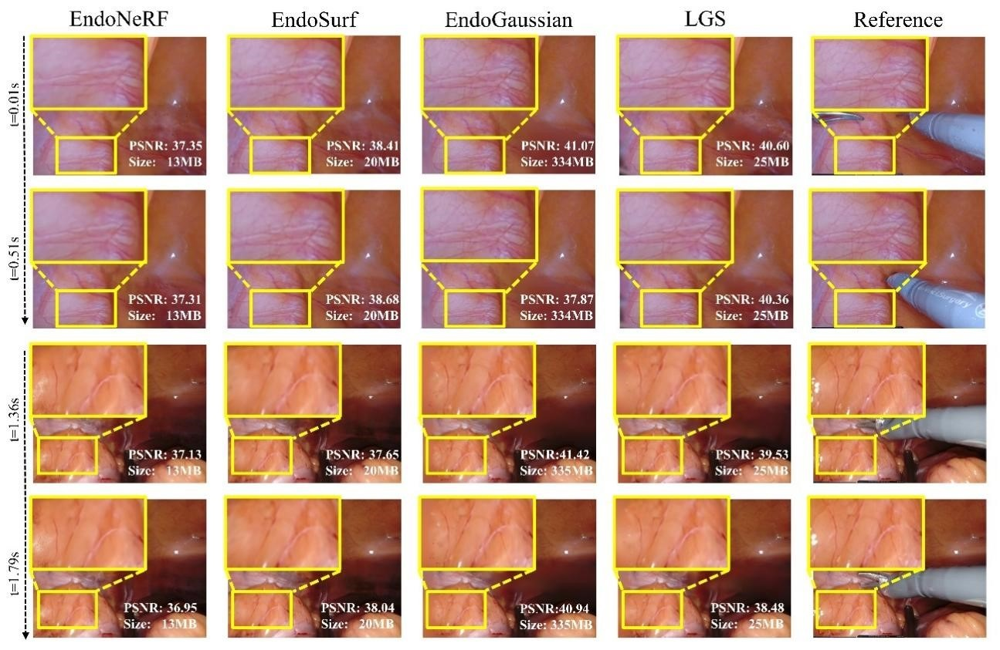
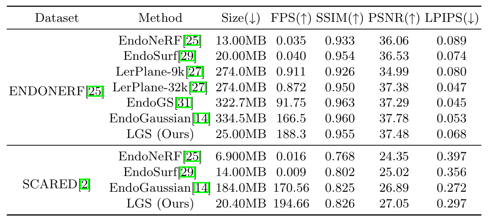

# LGS: A Light-weight 4D Gaussian Splatting for Efficient Surgical Scene Reconstruction

<!-- <i>The avatar is generated by stable diffusion.</i> -->


### [Project Page](https://lgs-endo.github.io/) | [ArXiv Paper](https://arxiv.org/abs/2406.16073)
### Accepted by International Conference on Medical Image Computing and Computer Assisted Intervention (MICCAI 2024)

[Hengyu Liu](https://github.com/LiuHengyu321)<sup>\*</sup>, 
[Yifan Liu](https://yifliu3.github.io/)<sup>\*</sup>,
[Chenxin Li](https://xggnet.github.io/)<sup>\*</sup>, 
[Wuyang Li](https://wymancv.github.io/wuyang.github.io/)<sup></sup>,
[Yixuan Yuan](https://www.ee.cuhk.edu.hk/en-gb/people/academic-staff/professors/prof-yixuan-yuan)<sup>✉</sup>

The Chinese University of Hong Kong

<sup>\*</sup> Equal Contribution, <sup>✉</sup> Corresponding Author. 

-------------------------------------------


## 💡Highlight
- We propose a holistic Lightweight 4D Gaussian Splatting (LGS) framework that allows for achieving satisfactory endoscopic reconstruction with both efficient rendering and storing.
- We present a Deformation-Aware Pruning (DAP) which alleviates the Quantity burden of Gaussian representation.
- We propose a Gaussian-Attribute Pruning (GAP), which addresses the High-dimension burden of Gaussian attributes.
- We present Feature Field Condensation (FFC) which mitigates the High-resolution burden of spatial-temporal deformable fields.
- Experimental results show that LGS can achieve higher storage efficiency with an over $9\times$ compression rate, whilst maintaining pleasing reconstruction quality and rendering speed.

## 🛠Setup

`submodules/simple_knn` can be download from [here](https://github.com/yifliu3/EndoGaussian/tree/master/submodules/simple-knn)
`compress-diff-gaussian-rasterization` can be download from [compress-diff-gaussian-rasterization](https://github.com/Kevin-2017/compress-diff-gaussian-rasterization/tree/240618bbc5fb21c270a0c5babb292615011a2f15)

```bash
git clone https://github.com/CUHK-AIM-Group/LGS.git
cd LGS
conda create -n lgs python=3.7
conda activate lgs

pip install -r requirements.txt

pip install -e submodules/depth-diff-gaussian-rasterization
pip install -e submodules/simple-knn
```

**Tips**: 2 GB GPU memory is required for training and inference. 

## 📚Data Preparation
Same to the 📚Data Preparation process of [EndoGaussian](https://github.com/yifliu3/EndoGaussian):

**ENDONERF** The dataset provided in [EndoNeRF](https://arxiv.org/abs/2206.15255) is used. You can download and process the dataset from their [website](https://github.com/med-air/EndoNeRF). We use the two accessible clips including 'pulling_soft_tissues' and 'cutting_tissues_twice'.

**SCARED** The dataset provided in [SCARED](https://endovissub2019-scared.grand-challenge.org/) is used. To obtain a link to the data and code release, sign the challenge rules and email them to max.allan@intusurg.com. You will receive a temporary link to download the data and code. Follow [MICCAI_challenge_preprocess](https://github.com/EikoLoki/MICCAI_challenge_preprocess) to extract data. The resulted file structure is as follows.


The file structure is as follows.
```
├── data
│   | endonerf 
│     ├── pulling
│     ├── cutting 
│   | scared
│     ├── dataset_1
│       ├── keyframe_1
│           ├── data
│       ├── ...
│     ├── dataset_2
|     ├── ...

```


## ⏳Training LGS
Run the following code to train LGS in a distillation scheme.
```bash
cd to this repo
conda activate engs

dataset="name/of/dataset"
test_name="name/of/output/file"
config_name="name/of/config"

check_point="/path/to/teacher/model/chkpntN.pth"
deformation_path="/path/to/teacher/model/point_cloud/iteration_N"

CUDA_VISIBLE_DEVICES=GPU_ID python train.py \
    -s /path/to/endonerf/cutting_tissues_twice/ \
    -m /path/to/endonerf/endonerf-output/ \
    --expname $dataset/new_init/$test_name \
    --start_checkpoint $check_point \
    --deformatioin_model_path $deformation_path \
    --teacher_model $check_point \
    --enable_covariance \
    --new_max_sh 2 \
    --iteration 4000 \
    --configs $config_name \
    --prune_percent 0.3 \
    --prune_decay 0.6 \
    --prune_iterations 2000 \
    --prune \
    --prune_threshold 0.5 \
    --prune_sh \
    --prune_deform \
    --v_pow 0.1 \
    --gt \
    --port $port > /path/to/log

```

### 📏Metric Evaluation
Run the following code to render and get the evaluaton.

```bash
CUDA_VISIBLE_DEVICES=GPU_ID python render.py --model_path /path/to/trained/model \
    --skip_train \
    --new_max_sh 2 \
    --configs $config_name > /path/to/log

CUDA_VISIBLE_DEVICES=GPU_ID python metrics.py --model_path /path/to/trained/model > /path/to/log
```


### 🎪Experiment Results
#### Quantitative Results

#### Qualitative Results



## 🛒TODO List
- [X] Release code for LGS
- [X] Clean up the code for LGS
- [ ] Updae the code for ablation experiments


## 🎈Acknowledgements
Greatly appreciate the tremendous effort for the following projects!
- [LightGaussian](https://github.com/VITA-Group/LightGaussian)
- [EndoGaussian](https://github.com/yifliu3/EndoGaussian)
- [3D GS](https://github.com/graphdeco-inria/gaussian-splatting)
- [4D GS](https://github.com/hustvl/4DGaussians)
- [EndoNeRF](https://github.com/med-air/EndoNeRF)
- [compress-diff-gaussian-rasterization](https://github.com/Kevin-2017/compress-diff-gaussian-rasterization/tree/240618bbc5fb21c270a0c5babb292615011a2f15)


## 📜Citation
If you find this work helpful for your project,please consider citing the following paper:
```
@article{liu2024lgs,
  title={LGS: A Light-weight 4D Gaussian Splatting for Efficient Surgical Scene Reconstruction},
  author={Liu, Hengyu and Liu, Yifan and Li, Chenxin and Li, Wuyang and Yuan, Yixuan},
  journal={arXiv preprint arXiv:2406.16073},
  year={2024}
}
```
